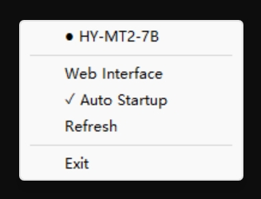

# lmgo-v2



[中文版 README](README_zh.md)

lmgo-v2 is a Windows system tray app that wraps llama.cpp server in **router mode**, providing dynamic model switching without restarts.

## System Requirements

- **OS:** Windows 11
- **Architecture:** x86_64
- **GPU:** CUDA 12.4+ compatible

For AMD ROCm builds, download a compatible llama-server from [llamacpp-rocm releases](https://github.com/lemonade-sdk/llamacpp-rocm/releases).

## Features

- **Router Mode**: Single llama-server process serves all models, switches on-demand via API
- **Dynamic Model Switching**: No restart required — change the `model` field in your API request
- **System Tray**: Minimal tray menu to open Web UI, toggle auto-start, and refresh config
- **Auto-start on Boot**: Option to start with Windows via Startup folder shortcut
- **Active Model Display**: Shows which model is currently loaded in the tray menu
- **Standard OpenAI API**: `GET /v1/models`, `POST /v1/chat/completions` — any OpenAI-compatible client works
- **INI Model Config**: `models.ini` defines models with per-model parameters (speculative decoding, mmproj, KV cache, etc.)

## Quick Start

1. Download `lmgo-v2.exe` from [releases](https://github.com/zyoung11/lmgo-v2/releases)
2. Place it in an empty folder
3. Run it — a tray icon appears, `config.json` and `models.ini` are generated
4. Edit `config.json` to set your `modelDir` path
5. Edit `models.ini` to tune per-model parameters
6. Click **Refresh** in the tray menu to apply changes

## Configuration

### config.json

```json
{
  "modelDir": "./models",
  "autoStartEnabled": false,
  "port": 19966,
  "pollInterval": 2,
  "defaultArgs": [
    "--host", "0.0.0.0",
    "--no-host",
    "-ngl", "999",
    "--flash-attn", "on",
    "--ctx-size", "131072",
    "--cache-type-k", "f16",
    "--cache-type-v", "f16",
    "--kv-offload",
    "--no-mmap",
    "--direct-io",
    "--mlock",
    "--split-mode", "layer",
    "--main-gpu", "0"
  ],
  "excludePatterns": ["mmproj*", "mtp*"]
}
```

| Field | Description |
|---|---|
| `modelDir` | Directory containing `.gguf` model files |
| `autoStartEnabled` | Auto-start with Windows |
| `port` | llama-server HTTP port |
| `pollInterval` | How often (seconds) to check which model is loaded for the tray display |
| `defaultArgs` | Global default CLI args applied to all models via `models.ini` `[*]` section |
| `excludePatterns` | Glob patterns to exclude from model scanning |

### models.ini

`[*]` section contains global defaults inherited by all models. Each model section defines per-model overrides:

```ini
[*]
host = 0.0.0.0
no-host = true
ngl = all
flash-attn = on
ctx-size = 131072
batch-size = 4096
ubatch-size = 4096
threads = 0
threads-batch = 0
cache-type-k = f16
cache-type-v = f16
kv-offload = true
no-mmap = true
direct-io = true
mlock = true
split-mode = layer
main-gpu = 0

[llama-3-8b]
model = D:/LLM/Llama-3-8B-Instruct.gguf
ctx-size = 8192
temp = 0.7

[gemma-4-12b]
model = D:/LLM/gemma-4-12B-it-qat-UD-Q4_K_XL.gguf
ctx-size = 262144
model-draft = D:/LLM/mtp-gemma-4-12B.gguf
spec-type = draft-mtp
spec-draft-n-max = 4
mmproj = D:/LLM/mmproj-F16.gguf
```

The section name is the model identifier used in API requests. All [llama-server CLI flags](https://github.com/ggml-org/llama.cpp) are valid INI keys (remove the leading `--`).

When `models.ini` already exists, Refresh only appends newly discovered `.gguf` files — your hand-edited config is preserved.

## API Usage

```
GET  http://localhost:19966/v1/models
POST http://localhost:19966/v1/chat/completions
```

Switch models by changing the `model` field:

```bash
curl http://localhost:19966/v1/chat/completions \
  -H "Content-Type: application/json" \
  -d '{"model":"gemma-4-12b","messages":[{"role":"user","content":"Hello"}]}'
```

```python
from openai import OpenAI
client = OpenAI(base_url="http://localhost:19966/v1", api_key="not-needed")
client.chat.completions.create(
    model="gemma-4-12b",
    messages=[{"role":"user","content":"Hello"}],
)
```

## Building from Source

```bash
go mod tidy
go build -ldflags "-s -w -H windowsgui" .
```

The embedded llama-server is extracted on first run. To use a different build, replace the `.zip` file before building.

## Related

- [lmgo](https://github.com/zyoung11/lmgo) — Previous version (process-based model management + lmc TUI)
- [llamacpp-rocm](https://github.com/lemonade-sdk/llamacpp-rocm) — AMD ROCm builds of llama.cpp
